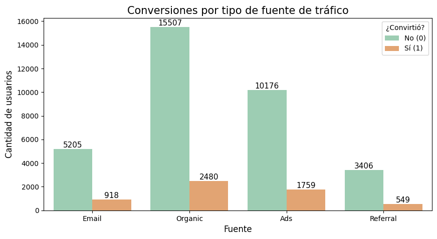
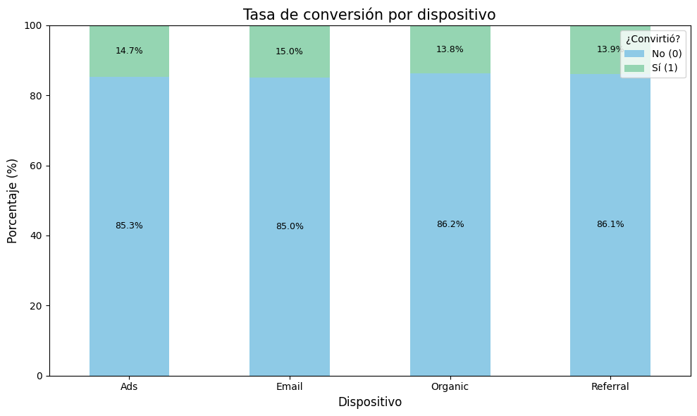
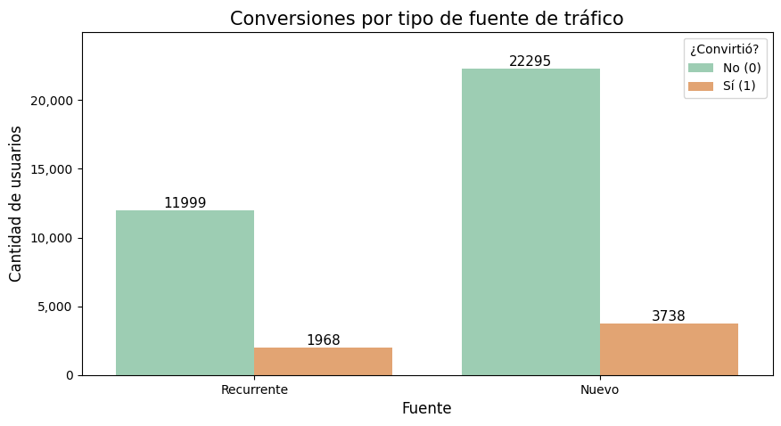

# Validación A/B de Conversión

Análisis estadístico de un experimento A/B en la landing page de un e-commerce, para decidir qué versión implementar con base en evidencia, no en intuición.

## Contexto

Se ejecutó un experimento A/B en la página de inicio comparando dos versiones (A: control, B: prueba) con el objetivo de mejorar la tasa de conversión y el valor económico por usuario. El dataset (`landing_experiment.csv`) incluye ~40,000 usuarios expuestos a ambas versiones, con región, dispositivo, fuente de tráfico, tipo de usuario, conversión y gasto.

## Preguntas clave

- ¿Existe una diferencia significativa en el gasto promedio por usuario convertido entre A y B?
- ¿Qué versión genera mayor tasa de conversión?
- ¿La conversión depende de la fuente de tráfico?
- ¿El tipo de usuario (nuevo o recurrente) influye en la conversión?

## Metodología

- Validación de calidad de datos (duplicados, rango temporal, resumen estadístico de `gasto` y `converted`)
- **Prueba T** (dos muestras independientes) para comparar el gasto promedio entre A y B, con prueba de Levene previa para verificar homogeneidad de varianzas
- **Prueba Z para proporciones** para comparar la tasa de conversión entre A y B
- **Chi-cuadrado de independencia** para evaluar la relación entre fuente de tráfico y conversión, y entre tipo de usuario y conversión
- Visualización con gráficos de barras agrupadas y apiladas para respaldar cada hallazgo
- Interpretación de cada resultado en términos de significancia estadística *y* relevancia práctica de negocio (no solo p-value)

## Resultados

| Métrica | Página A | Página B | Diferencia |
|---|---|---|---|
| Tasa de conversión | 12.57% | 15.96% | +3.38 pp |
| Gasto promedio (usuarios convertidos) | $61.09 | $68.75 | +$7.65 |

- **Gasto promedio**: diferencia estadísticamente significativa a favor de B (prueba T, p = 3.63e-21)
- **Tasa de conversión**: diferencia estadísticamente significativa a favor de B (prueba Z, p = 3.76e-22)
- **Fuente de tráfico**: asociación estadísticamente significativa con la conversión (χ² = 8.662, p = 0.034), pero de magnitud baja — brecha máxima de ~1.2 pp entre canales (Email 14.99%, Ads 14.74%, Referral 13.88%, Organic 13.79%)
- **Tipo de usuario**: sin asociación significativa con la conversión (χ² = 0.513, p = 0.474) — Nuevos 14.36% vs. Recurrentes 14.09%

## Recomendaciones de negocio

1. **Considerar la página B como candidata para implementación** — mayor conversión y mayor gasto promedio, aunque se recomienda evaluar el costo de implementación y validar que los resultados se sostengan fuera del entorno controlado del experimento
2. **Explorar mejoras en el canal Organic**, que concentra ~45% del tráfico pero tiene la tasa de conversión más baja — el mayor impacto potencial en volumen
3. **Mantener y monitorear la inversión en Email y Ads**, los canales con mejor conversión
4. **No priorizar segmentación por tipo de usuario** en esta etapa, dado que no se encontró diferencia significativa entre usuarios nuevos y recurrentes

## Visualizaciones

| | |
|---|---|
|  |  |
|  |  |

## Herramientas

Python (pandas, scipy, matplotlib/seaborn) en Jupyter Notebook — pruebas T, Z y chi-cuadrado.

## Estructura del repo

```
ab-test-landing-conversion/
├── Validacion_AB_Conversion.ipynb
├── landing_experiment.csv
├── images/
└── README.md
```
